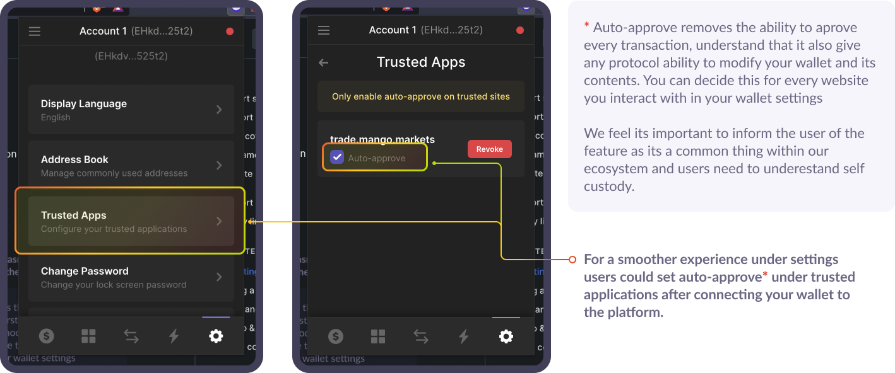

# 🥭 Initial Setup

* Create a Mango Markets account
* Deposits are cross-collateralised and positions cross-margined
* Health is used to determine liquidations and new position eligibility

## **Connecting your Wallet**

First, choose your wallet and then click connect.

* For help creating or funding your wallet, please see [our dedicated article](../../tutorials/creating-a-wallet.md#how-to-create-a-sollet-io-wallet).

 (1).png>)

After connecting, under settings you can decide whether auto-approval is on or off and approve the connection.

_Using Auto-approve will give a smoother trading experience (more like a centralised exchange). If you decide not to use it, you will need to approve every transaction you make within the platform._

## **Creating a** Mango Markets account **& depositing funds**

It's time to create and fund your first 🥭Mango Markets Account. Simply click on the deposit button within the account modal.

.png>)

In the account creation modal, first, decide whether to name your account or not. Next, choose the asset you want to fund your Mango Markets Account with and enter the amount you want to deposit.

You will need **0.035 SOL** in your wallet to open a Mango Markets Account.

## Understanding Collateral on Mango Markets🥭

Within Mango Markets, all your assets are considered "collateral," which means you can use any one asset to buy any of the other assets. So something like positions will naturally work a little differently between spot and perpetual markets and might feel a little different compared with normal exchanges that don't offer full asset cross-collateralisation within their platform.

On Mango Markets, collateral health is connected to your _Health Ratio,_ which is based on your collateral ratio. This essentially allows you to utilise any asset to trade or borrow against any other asset all being handled by the Mango Markets risk engine.

For example, if you have $100 of USDC within your account you can exchange that for up to 5x of another asset, depending on the market's collateral ratio (MNGO, SOL, SRM, USDT, BTC, and ETH) while still holding your original USDC position. You can also withdraw funds as needed and pay back your liabilities to keep your health ratio in the green.

#### Watch your Health Ratio ❤️

Once a position is opened, it must maintain a Health Ratio above 0%. If an account falls to 0% it will be liquidated and funds will be lost. To increase you Health Ratio, reduce your borrows or deposit funds into your Mango Markets Account to top up the health bar.\
\
The current Health Ratio is displayed in two places, on the trade page and under your accounts page.

## Portfolio & Position Management

Mango Markets offers a robust, simple and intuitive interface for managing your Mango Markets Account and its liabilities.

**View everything:**

* Account Value, Leverage, Health Ratio, MNGO Rewards
* Perpetual Positions
* Assets & Liabilities
* Total Liabilities Value
* Asset Balances
* Current Open Orders, Transaction History

**Manage your portfolio and all positions right on the** [**account page.** ](https://trade.mango.markets/account)\*\*\*\*

