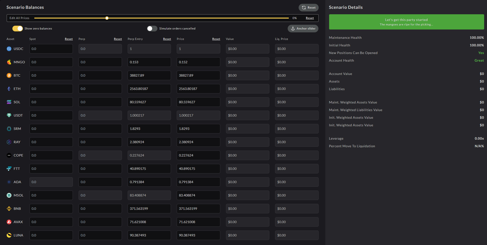
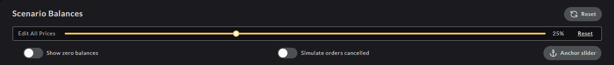
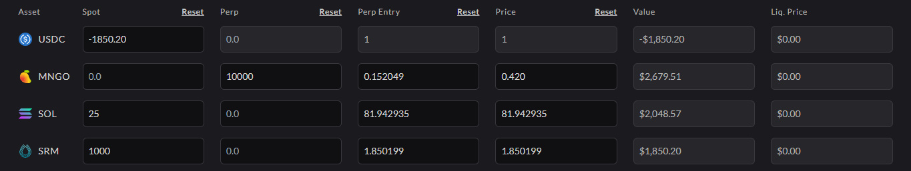
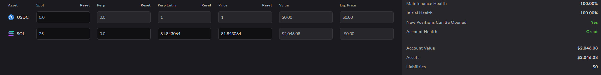
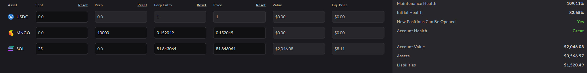
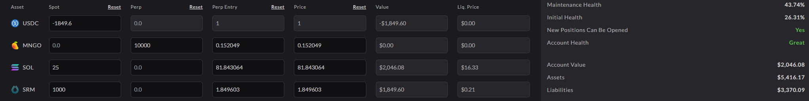

# 🔢 Risk Calculator

With the Risk Calculator you can estimate your Health Ratio by simulating changes to an account's token deposits, borrows, perp positions and pricing. It can be useful to help traders develop strategies based on their project of market movements which may be simple, such as changing the price of a token, or more complex, such as developing a delta-neutral strategy.

You must keep your Maitenance Health Ratio above 0% in order to avoid liquidation and the Risk Calculator is designed to assist traders in understanding the potential impact of their trades.

You can read more about the health calculation on the [**Health Overview**](../../faqs/health.md) page.

## Anatomy of the Risk Calculator

The risk calculator consists of 3 main parts:

* Quick Tools: Dynamically alter prices, simulate order cancellation, and hide zero balances.
* Scenario Input Table: Simulate deposits, withdrawals, and perp positions at different price points.
* Scenario Details: Summarises the estimated health based on the above inputs.

Let's dive into these a little deeper:

#### **Quick Tools**

The quick tools are intended to help traders estimate average market movements for all tokens, as well as reduce the amount of information in the window.

The options available using the quick tools are:

* **Reset Button**: Resets the entire scenario to default. If no account is connected, this creates a "Blank Slate" template.
* **Price Slider**: Adjusts the price of all tokens by the selected percent (-100% to +250%). "Reset" to return to 0%.
* **Show Zero Balance Toggle**: Hides or displays tokens with zero balance and zero active perp positions
* **Simulate Orders Cancelled Toggle**: Calculates the health the scenario with or without existing orders being considered.
* **Anchor Slider Button**: Adjusts the currently displayed prices to be the default price, resetting the slider to 0%.

#### **Scenario Input Table**

The scenario input table is the heart of the calculator and allows for detailed strategies to be developed.

When an account is connected, the input rows will self-populate with the trader's current positions. When no account connected, the rows will be blank.

The blank slate might be particularly useful for traders new to Mango Markets as they can get a feel for the Health Ratio calculations. There is a row for each token that is trading on Mango Markets where users can input spot and perpetual positions as well as adjust the price. Each column of the table has its own "reset" button that will reset the column leaving the other columns as they are. For a full reset, press the "Reset" button at the top right of the calculator. Where a market does not exist, the cell in that column will be disabled, preventing input.

There are four primary columns that take input and their function are as follows:

* **Spot**: View or simulate deposit and borrow balances (Positive is counted as a deposit, Negative is counted as a borrow).
* **Perp**: View or simulate long and short positions (Positive is counted as a Long position, Negative is counted as a Short position).
* **Perp Entry**: Enter you expected average entry price for a perp position.
* **Price**: Adjust the token price to the desired scenario price.

The two additional columns calculate the simulated value of your positions, and the single asset liquidation price which displays the price at which your account would be liquidated if only the price of that token moves.

#### **Scenario Details**

The "Scenario Details" displays a summary of the various health stats based on your input in the Quick Tools and Scenario Input Table.

The key field being the Maintenance Health, which determines if a position is eligible for liquidation. Maintenance Health must be kept above zero to avoid liquidation. Another important stat is the Initial Health which determines if new positions can be opened based on the current scenario. When the Initial Health falls below zero, no new positions can be opened, and the "New Positions Can Be Opened" field will display "No."

The various fields showing dollar values, summarise the scenario's inputs and asset weightings. Read the [**Health Overview** ](../../faqs/health.md)for more details page.

The final two fields of the summary display displays the simulated account leverage, as well as the Percent Move To Liquidation, which estimates the percent move in the market as a whole that would be required to liquidate the scenario. This field will display "N/A" if it is unlikely that the market moving in unison would result in liquidation. You can test this feature using the Price Slider.

## Important Note

When you are intending to simulate a spot purchase, you will need to add both the token purchased to your Spot balance and subtract the USDC required for the purchase. Where there is insufficient USDC in the account to cover the cost of the intended purchase, you will need to input this as a negative number to indicate that you have "borrowed" this amount of USDC to purchase the token.

## Example Usage

You have 25 SOL deposited on Mango Markets and wish to open a 10,000 MNGO long position, as well as purchase 1,000 SRM using your SOL as collateral, and want to know the health of your account should you do so.

Firstly, connected your account and open the Risk Calculator. Your Health should be at 100% because you assets deposited, but no liabilities.

Then, in the MNGO row, enter 10,000 into the Perp column. Your account health should now show a different health percentage as the MNGO counts as both a asset and a liability.

Finally, in the SRM row, enter 1,000 into the Spot column and because you are borrowing against your collateral, you will also need to subtract the dollar value from your USDC holdings. For this example, SRM is $1.85, so you will need to subtract $1,850 from your USDC balance.

The resultant health for this example is \~43%, which indicates you can establish these positions at the set prices with your current collateral.
