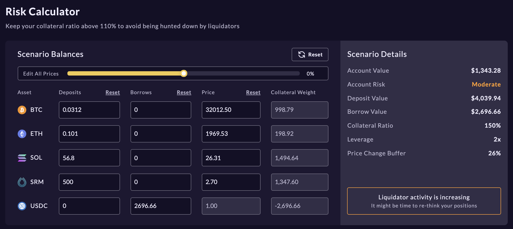
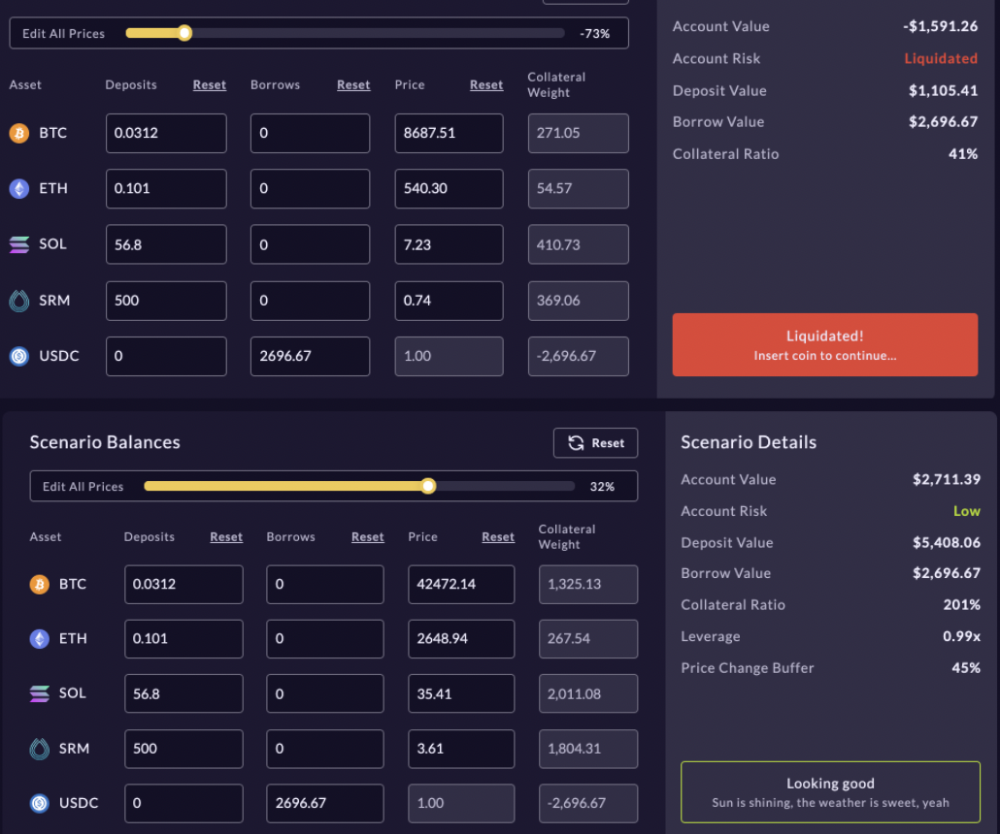

# Borrowing & Lending 💸

## Don't sell, just utilize 

🥭offers an approachable and powerful platform. Under the hood, the mango risk engine permits users to take out fully collateralized loans against any deposited assets, and deposits into margin accounts accrue interest every second.

**Check out the **[**Account page. **](https://trade.mango.markets/account)****

## **Borrowing on **🥭

First, ensure assets are [deposited into your margin account](https://app.gitbook.com/@blockworksfoundation/s/mango/\~/drafts/-MZPLylXCNfAFWlrfxMI/tutorials/trade-on-mango.markets#connecting-to-mango-markets-and-depositing-funds) for use as collateral. Then, simply click 'Withdraw' under the accounts tab or "Borrow" under the _Borrow_ tab. 

The UI will prompt you to select the asset you wish to withdraw and borrow, and toggle 'Borrow Funds' on. 

Next, determine the amount you'd like to withdraw. Remember, borrowing funds affects your [collateral ratio](https://app.gitbook.com/@blockworksfoundation/s/mango/\~/drafts/-MZPLylXCNfAFWlrfxMI/tutorials/trade-on-mango.markets#how-to-trade-with-leverage) and leverage calculation. If you'd like to withdraw the maximum amount with collateral ratio above maintenance margin threshold, click 'Max with borrow'. An estimated leverage post-withdraw is displayed. 

 Click 'Withdraw' and approve the transaction from your wallet to complete.

Interest is paid on your borrows continuously from your deposits. Please monitor interest rates as they recalculate based on pool utilization. 

**To repay your loan, deposit or trade for the borrowed asset.**

## How to use the Risk Calculator 

The Risk Calculator tool helps estimate liquidation scenarios on leveraged positions. Liquidation events occur when your [Collateral Ratio](https://app.gitbook.com/@blockworksfoundation/s/mango/\~/drafts/-Mf9lVu8a9wqsacHHCGf/tutorials/trade-on-mango.markets#how-to-trade-with-leverage) drops below 110%. Since positions are cross-margined, there is not always a straight forward liquidation price to provide. With this tool, you can predict liquidations by providing assumptions on asset prices and other account details.

Select 'Risk Calculator' below your account calculations.

Your Account Risk assessment, Collateral Ratio, and Price Change Buffer are displayed on the right in Scenario Details. 

The Scenario Balances section enables manipulation of deposits, borrows, and asset prices and displays the effect on you Collateral Ratio and liquidation risk. 

Individual asset price, deposits, and borrows can be changed in their corresponding columns. Price movements across all markets can be applied by the 'Edit All Prices' slider. Resulting Scenario Details will share information on new account health including Collateral Ratio and liquidation status based off new assumptions. 

## **Video Tutorial **

This comprehensive video tutorial created by CryptoData covers everything from creating and funding your sollet wallet to trading and lending on Mango Markets exchange.



## **Join the community **👾

The Mango team is committed to providing a fully decentralized, open source, leveraged trading platform capable of matching a centralized-exchange feel with all the unique benefits of DeFi. We are excited to launch Mango Markets and continue bringing new leveraged trading products to life in decentralized form. Visit us at [mango.markets](https://mango.markets) to trade and lend.

Follow Mango Markets on Twitter and join the Discord for the latest updates.

twitter:[ https://twitter.com/mangomarkets](https://twitter.com/mangomarkets)

discord: [https://discord.gg/YpzUSTwd](https://discord.gg/P7TzZS9g)
