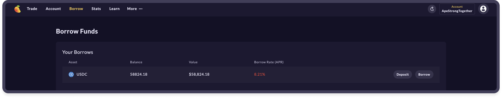
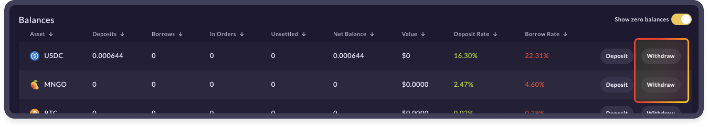
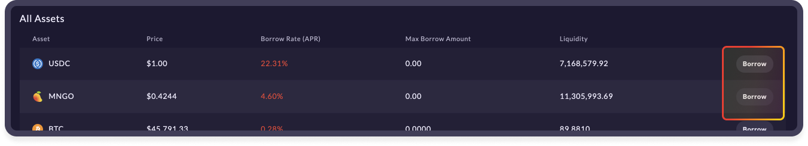
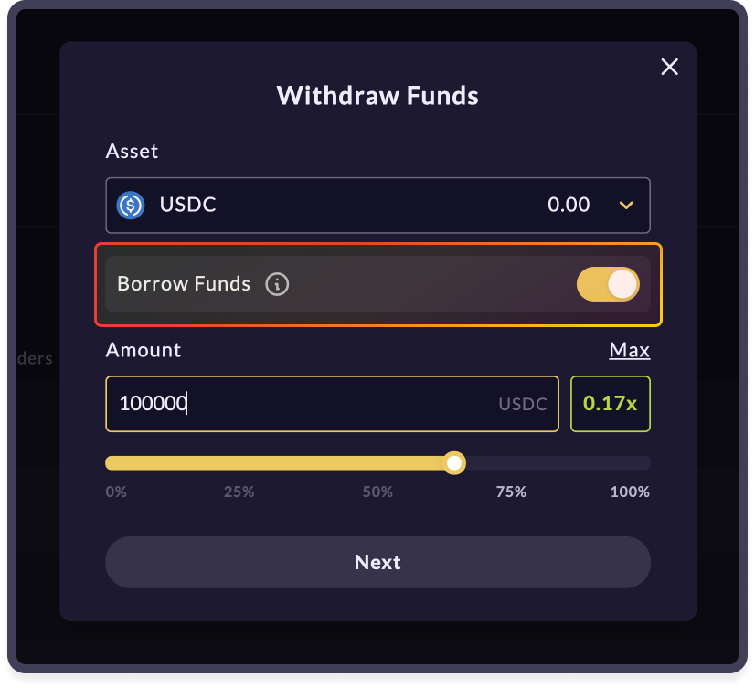
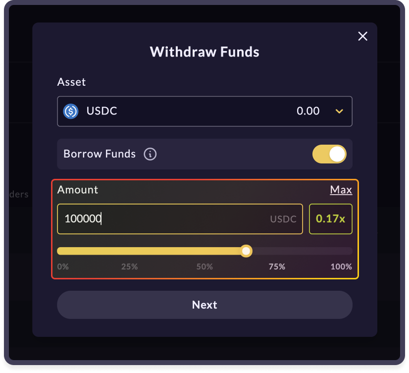
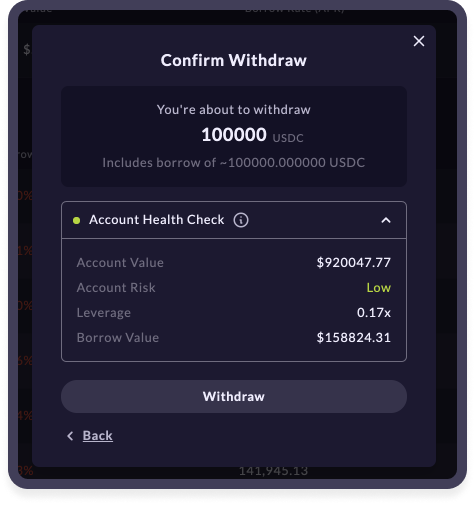

# 💵 Borrowing & Lending

* Deposit into MangoAccount to automatically earn interest; interest is paid continuously to balances
* Borrow against your collateral with a withdraw&#x20;
* Track interest earned/paid in Account History

## Don't sell, just utilize&#x20;

🥭 offers an approachable and powerful platform. Under the hood, the mango risk engine permits users to take out fully collateralized loans against any deposited assets, and deposits into you MangoAccount accrue interest every second.

**Check out the** [**Account page.** ](https://trade.mango.markets/account)****

## **Borrowing on** 🥭

First, ensure assets are [deposited into your margin account](https://docs.mango.markets/tutorials/getting-started#creating-a-margin-account-and-depositing-funds) for use as collateral. Then, simply click 'Withdraw' under the accounts tab or "Borrow" under the _Borrow_ tab.&#x20;

The UI will prompt you to select the asset you wish to withdraw and borrow, and toggle 'Borrow Funds' on.&#x20;

Next, determine the amount you'd like to withdraw. Remember, borrowing funds affects your [collateral ratio](https://app.gitbook.com/@blockworksfoundation/s/mango/\~/drafts/-MZPLylXCNfAFWlrfxMI/tutorials/trade-on-mango.markets#how-to-trade-with-leverage) and leverage calculation. If you'd like to withdraw the maximum amount with collateral ratio above maintenance margin threshold, click 'Max with borrow'. An estimated leverage post-withdraw is displayed.&#x20;

&#x20;Click 'Withdraw' and approve the transaction from your wallet to complete.

Interest is paid on your borrows continuously from your deposits. Please monitor interest rates as they recalculate based on pool utilization.&#x20;

**To repay your loan, deposit or trade for the borrowed asset.**

##

## **Video Tutorial**&#x20;

This comprehensive video tutorial created by CryptoData covers everything from creating and funding your sollet wallet to trading and lending on Mango Markets exchange.



## **Join the community** 👾

The Mango team is committed to providing a fully decentralized, open source, leveraged trading platform capable of matching a centralized-exchange feel with all the unique benefits of DeFi. We are excited to launch Mango Markets and continue bringing new leveraged trading products to life in decentralized form. Visit us at [mango.markets](https://mango.markets) to trade and lend.

Follow Mango Markets on Twitter and join the Discord for the latest updates.

twitter:[ https://twitter.com/mangomarkets](https://twitter.com/mangomarkets)

discord: [https://discord.gg/YpzUSTwd](https://discord.gg/P7TzZS9g)
