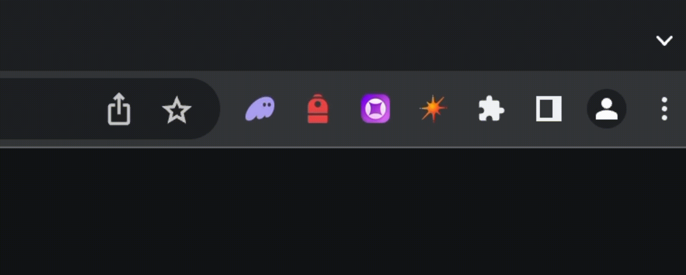
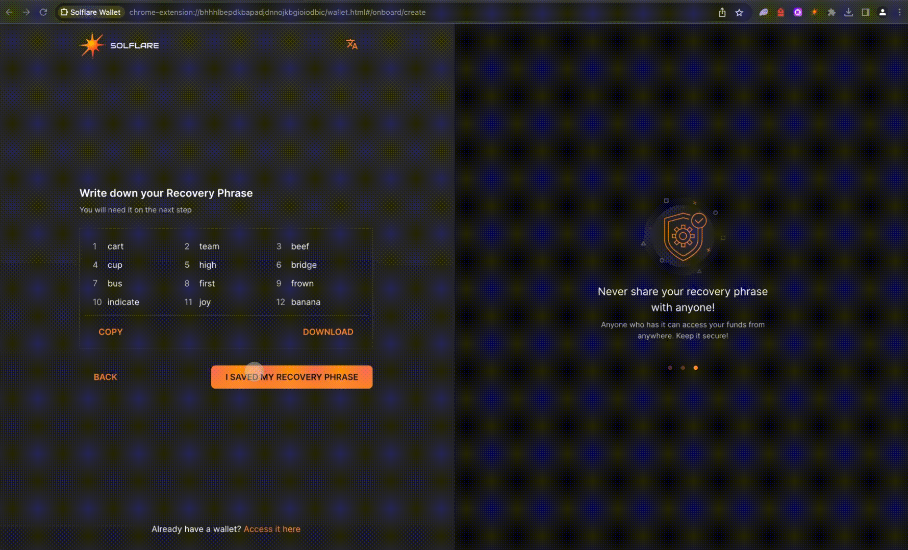

# 👛 DeFi Wallets

Mango Markets is built on the Solana blockchain. To interact with the ecosystem, you will need a Solana-compatible wallet. Mango Markets offers compatibility with many different wallets. A popular wallet, and our favorite for first-time user experience is [Phantom](https://phantom.app).

You can access Mango on both mobile and desktop.&#x20;

## **How to create a Desktop Wallet**

To begin, first find a solution that fits your needs:

* Phantom: [https://phantom.app/](https://phantom.app/)
* Backpack: [https://www.backpack.app/](https://www.backpack.app/)
* Glow: [https://glow.app/](https://glow.app/)
* Solflare: [https://solflare.com/](https://solflare.com/)

<figure><figcaption></figcaption></figure>

**Lets create a Solflare wallet** :fire::sunny:

If you are a brand new Solana user, select "**I Need a new wallet."** If you are an existing Solana user and have another wallet, simply import it and continue.

<figure><figcaption>
You must store "<strong>Recovery Phrase</strong>" in a safe location, it is the only way to recover your wallet. Non-custodial means none of these wallets have access to your funds. Whoever has access to this phrase has access to the funds, so keep it safe and secure.
</figcaption></figure>

After you've secured your seed phrase, finish the wallets onboarding process as instructed.&#x20;

<figure><figcaption></figcaption></figure>

Once you complete the wallet onboarding you can access your wallet right from your browser extension list. (the flow is similar for all these extention wallets)

<figure><figcaption></figcaption></figure>

## **How to create a Mobile Wallet**

Find a solution that fits your needs, download an appropriate mobile wallet for your device (apple or android)

* Phantom: [https://phantom.app/](https://phantom.app/)
* Backpack: (soon)
* Glow: [https://glow.app/](https://glow.app/)
* Solflare: [https://solflare.com/](https://solflare.com/)
* Ottr: [https://ottr.finance/](https://ottr.finance/)
* Ulitmate: [https://ultimate.app/](https://ultimate.app/)

Follow the wallet on-boarding flow to get set up quickly.&#x20;
