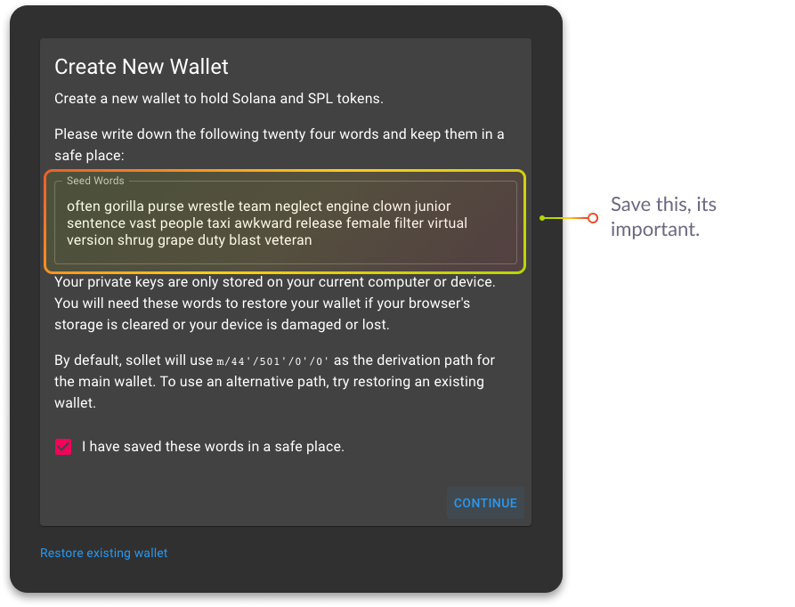
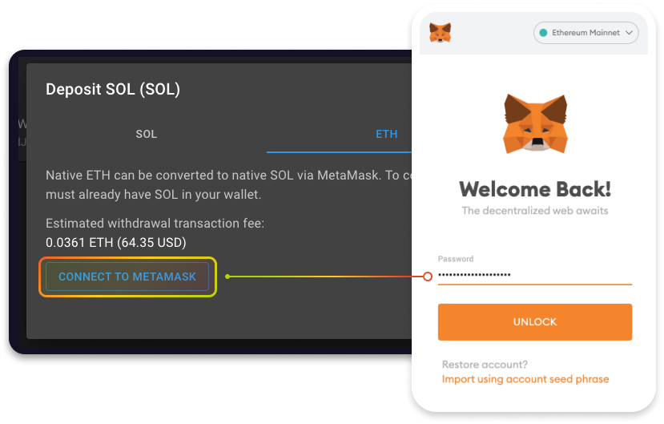
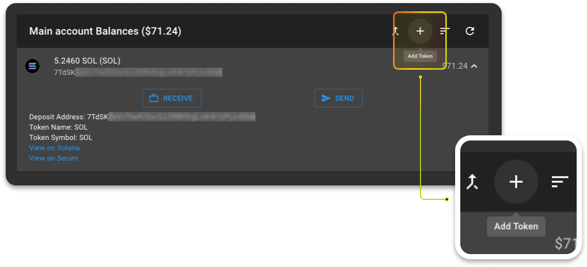
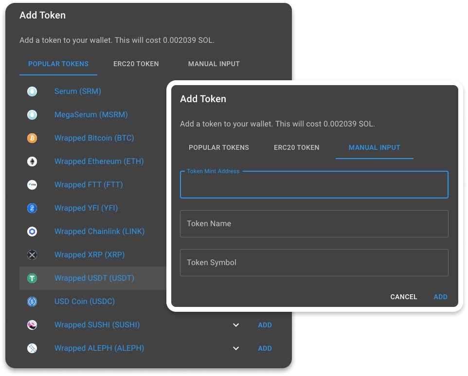
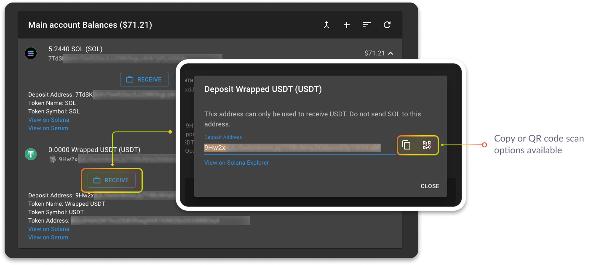
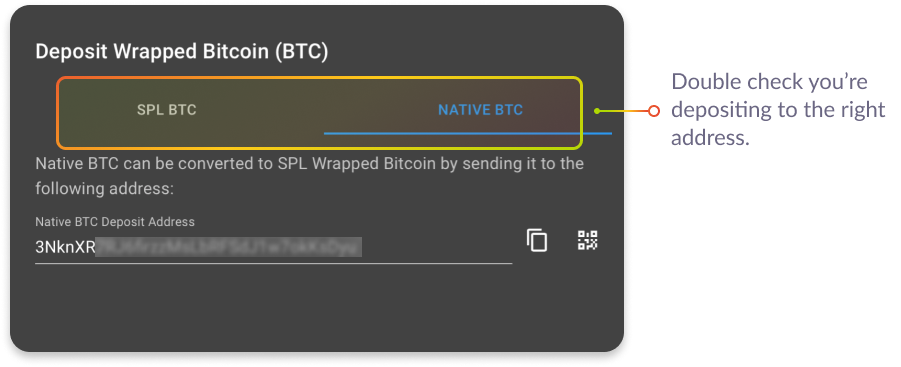
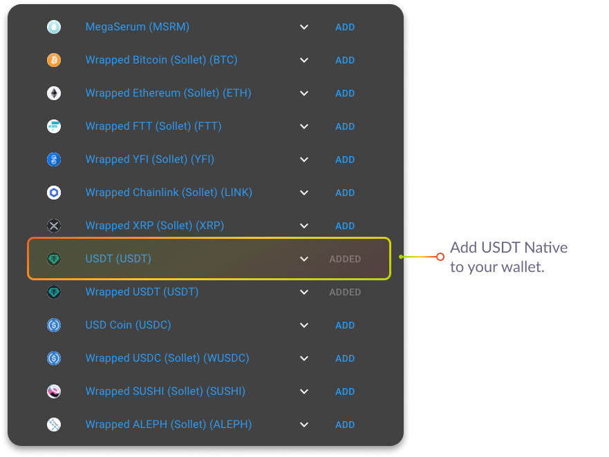
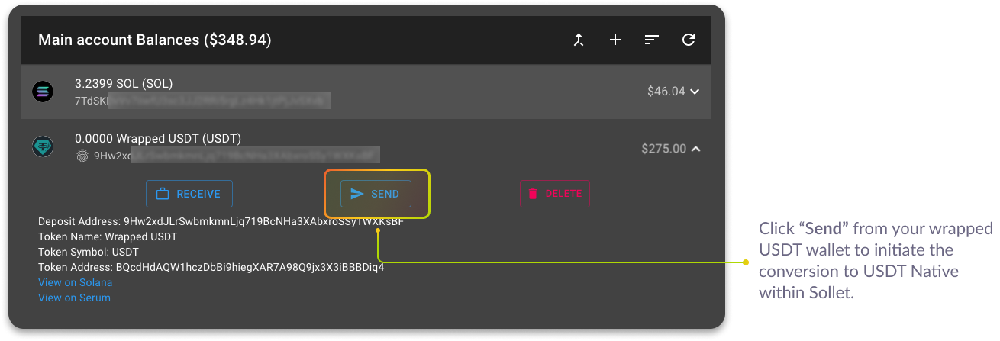
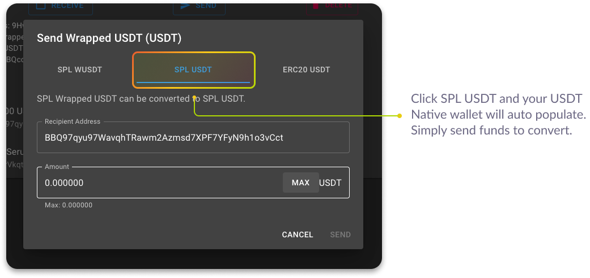

# Creating & Funding a Wallet 👛

Mango Markets is built on the Solana blockchain. To interact with the ecosystem, you’ll need a Solana-compatible wallet. Mango offers compatibility with 2 different wallets. A popular wallet and our favorite for first-time user experience,  [Phantom](https://phantom.app/); and also [Sollet.io](https://www.sollet.io/), a more dev/power user-focused wallet.

Continue reading to learn how to create and transfer funds to a wallet.

## **How to create a Phantom wallet**

To begin, visit  [https://phantom.app/download](https://phantom.app/download)

Add Phantom to your browser to get started. Once installed, you should be prompted with two options, create a new wallet, or restore an old one:

If you are a brand new Solana user, select "**Create New Wallet**". If you are an existing Solana user and have another wallet, simply import it and continue. 

Users coming from sollet can follow the steps [here](https://phantom.app/help/migrating-from-sollet-to-phantom) to migrate existing wallets to Phantom.

You must store "**Recovery Phrase**" in a safe location, it is the only way to recover your wallet. Phantom does not have access to your funds. Whoever has access to this phrase has access to your funds, so keep it safe and secure!

## **How to create a Sollet.io wallet**

To begin, visit [https://www.sollet.io/](https://www.sollet.io/).  
  
Sollet.io stores private keys in your web browser. You must access the wallet from the same web browser you created it in; otherwise, you’ll be prompted to create a new one. 

The first step in creating a new wallet is recording your seed phrase in a safe place. This phrase is the only way to recover and restore your wallet’s funds in case you forget your password, the computer breaks, or sometimes even when you clear browser cookies. This phrase is very important, so please keep it somewhere safe!

After you record your phrase in a safe place and click ‘Continue’, you’ll be prompted to add a password to your wallet. Although this step is optional, it’s highly suggested for security purposes. Enter your desired password and click ‘Create Wallet’. 

Congratulations, you’ve successfully created a Sollet.io wallet! 

## **How to add funds to a Sollet.io wallet**

In the Solana ecosystem, different tokens have separate addresses in the same wallet. This is different from the Ethereum network, for example, where different ERC-20 tokens are received by the same address. 

Transaction fees on the network are paid in SOL. To add new tokens addresses to your wallet or send funds you’ll need some SOL. To add SOL to your wallet, click on SOL asset to expand the menu and then ‘Receive’.

The deposit address displayed is the address to which SOL can be sent to your wallet. Only send SOL to this address, all other tokens \(including SPL tokens like SRM\) will have different deposit addresses.

SOL can be bought on exchanges like [FTX](https://ftx.com/), [Binance](https://www.binance.com/en), [FTX US](https://ftx.us/), and more. Additionally, ETH held on Metamask can be converted to SOL into your Sollet.io. To do this, in the deposit SOL window, click ‘ETH’ and then ‘Connect to Metamask’.

On Solana, tokens that you wish to trade or hold must be explicitly added to your wallet. Once your wallet is funded with SOL, you can add different tokens by clicking the ‘+’ sign in your account menu. Adding new tokens costs a small amount of SOL.

Browse popular tokens or search through manual input with the token mint address.

After you’ve found your desired token, click ‘Add’ and the token will appear in the main account of your wallet. 

To receive funds of added token addresses, click on the asset you wish to deposit and then ‘Receive’ in your main account. 

The deposit address displayed is the address to which your selected asset can be sent to your wallet. Only the selected token type should be sent to this address, other tokens will have different deposit addresses.

Some tokens, like BTC, possess multiple accepted mint types. SPL BTC can be deposited into your wallet using the SPL BTC deposit address while Native BTC is accepted by its own address. Click ‘Native BTC’ in the receive BTC menu to find this deposit address. 

Congratulations, you can now transfer funds to your sollet.io wallet!

## How to swap Wrapped USDT for Native USDT

Native USDT is now available on Solana and Serum DEX is transitioning all liquidity pairs from wrapped USDT \(wUSDT\) to new, native USDT. This means in order to trade on USDT pairs in Serum, you'll need native USDT. 

First, please visit [https://wusdt.mango.markets](https://wusdt.mango.markets) to close your BTC and ETH positions. Once positions are closed and settled, withdraw your wrapped USDT \(wUSDT\) along with any deposited SRM in the Fee Discounts tab. To continue trading, follow the steps below to convert your wUSDT to native USDT and then visit [https://trade.mango.markets](https://trade.mango.markets)

Sollet.io makes it easy to convert wUSDT to native USDT.  First, add USDT token address to your wallet: 

Next, in your Main account menu click the Wrapped USDT asset and 'Send'

Select 'SPL USDT' in the send window; your USDT address will autopopulate in the Recipient Address \(please double check it is accurate\), enter the amount you'd like to convert to native USDT, and click 'Send'. 

Congratulations! Your wUSDT has been converted to USDT and is visible in your USDT address. 

##     

