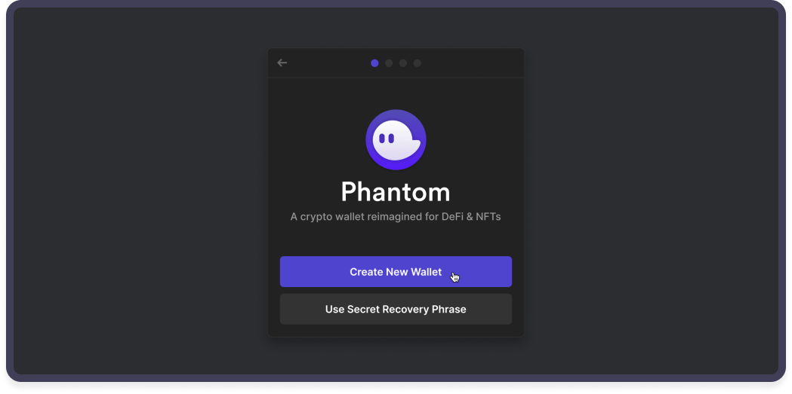
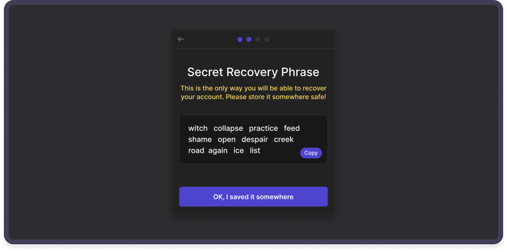

# 👛 DeFi Wallet

Mango Markets is built on the Solana blockchain. To interact with the ecosystem, you will need a Solana-compatible wallet. Mango Markets offers compatibility with many different wallets. A popular wallet, and our favorite for first-time user experience is [Phantom](https://phantom.app).

Continue reading to learn how to create and transfer funds to a wallet.

## **How to create a Phantom wallet**

To begin, visit [https://phantom.app/download](https://phantom.app/download)

Add Phantom to your browser to get started. Once installed, you should be prompted with two options, create a new wallet, or restore an old one:

If you are a brand new Solana user, select "**Create New Wallet."** If you are an existing Solana user and have another wallet, simply import it and continue.

You must store "**Recovery Phrase**" in a safe location, it is the only way to recover your wallet. Phantom does not have access to your funds. Whoever has access to this phrase has access to your funds, so keep it safe and secure.
