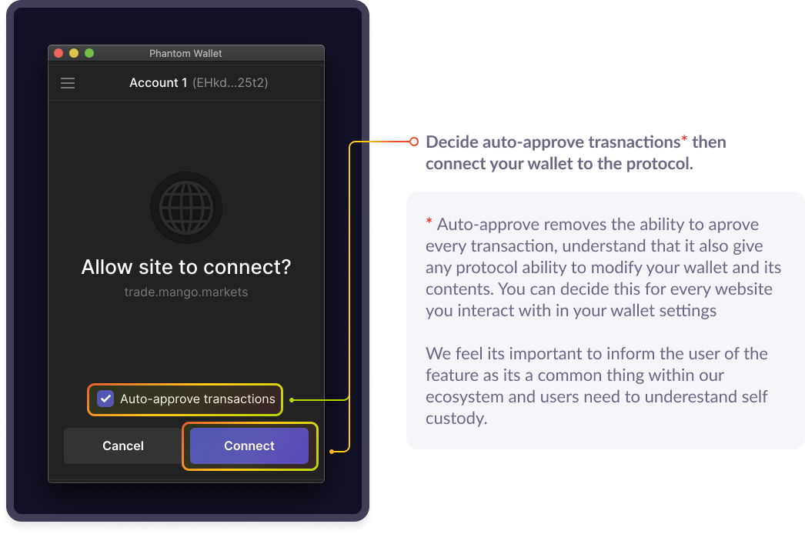
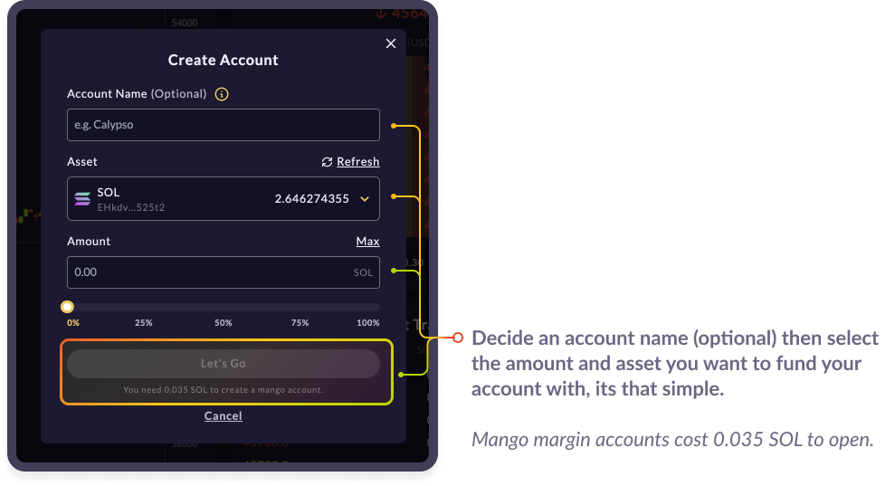
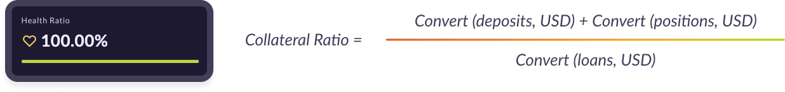
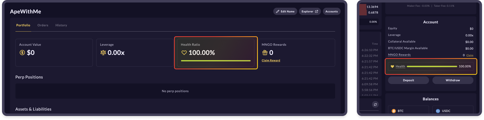
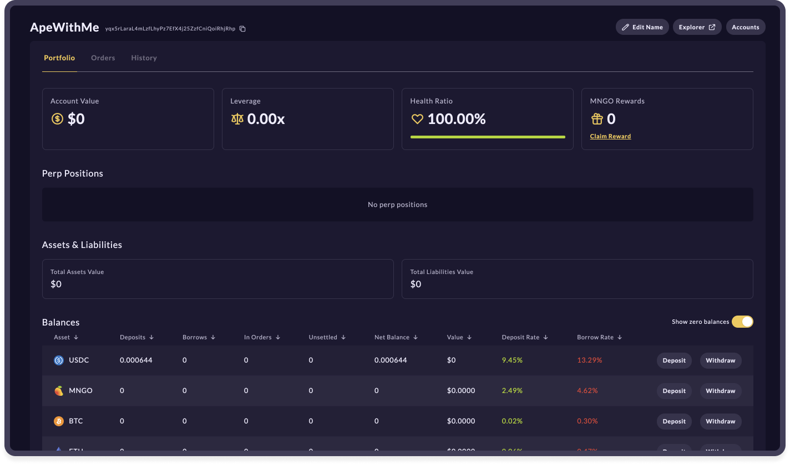

# Initial set up with 🥭

## **Connecting your Wallet**

First, choose your wallet and then click connect.

* For help creating or funding your wallet, please see [our dedicated article](creating-a-wallet.md#how-to-create-a-sollet-io-wallet).

.png>)

Next, decide whether auto-approval is on or off and approve the connection

_**\*\***Selecting on will give a smoother trading experience (more like a CEX.) keeping it off you will need to approve every transaction within the platform._

## **Creating a** 🥭 margin **account & depositing funds**

It's time to create and fund your first 🥭Margin Account. Simply click on the deposit  button within the account modal to initiate the margin account creation modal.

.png>)

In the account creation modal, first, decide to name your account or not. Next, choose the asset you want to fund your margin account with and enter the amount you want to deposit.&#x20;

You’ll need **0.035 SOL** in your wallet to open a mango margin account.&#x20;

## Understanding Collateral on 🥭

Within mango, all your assets are considered "collateral", which means you can use any one asset to buy any of the other assets. So something like positions on Mango will naturally work a little differently between spot and perpetual markets and might feel a little different than normal exchanges that don't offer full asset cross-collateralization already within their platform.

On mango collateral health is connected to your _Health Ratio,_ which is based on your collateral ratio. This essentially allows you to utilize any asset to trade or borrow against any other asset all being handled by Mango and its risk engine.

For example, if you have $100 of USDC within your account you can exchange that for up to 5x of another asset, depending on the market's collateral ratio (MNGO, SOL, SRM, USDT, BTC, and ETH) while still holding your original USDC position. You can also withdraw funds as needed and pay back your liabilities to keep your health ratio in the green.

#### Watch your Health Ratio ❤️&#x20;

Once a position is opened, it must maintain a Health Ratio above 0%. If an account falls to 0% it will be liquidated and funds lost. To increase Health Ratio, reduce borrows or deposit funds into your margin account to top up the health bar. \
\
The current Health Ratio is displayed in two places, on the trade page and under your accounts page.&#x20;

## Portfolio & Position Management

Mango offers a really robust, simple, and intuitive interface for managing your margin account and its liabilities.

**View everything:**

* Account Value, Leverage, Health Ratio, MNGO Rewards
* Perpetual Positions
* Assets & Liabilities
* Total Liabilities Value
* Asset Balances
* Current Open Orders, Transaction History

More features being added.

**Manage your portfolio and all positions right on the** [**account page.** ](https://trade.mango.markets/account)****

## **Join the community** 👾

The Mango team is committed to providing a fully decentralized, open source, leveraged trading platform capable of matching a centralized-exchange feel with all the unique benefits of DeFi. We are excited to launch Mango Markets and continue bringing new leveraged trading products to life in decentralized form. Visit us at [mango.markets](https://mango.markets) to trade and lend.

Follow Mango Markets on Twitter and join the Discord for the latest updates.

twitter:[ https://twitter.com/mangomarkets](https://twitter.com/mangomarkets)

discord: [https://discord.gg/YpzUSTwd](https://discord.gg/P7TzZS9g)

## &#x20;    

\
\
\
\
\
