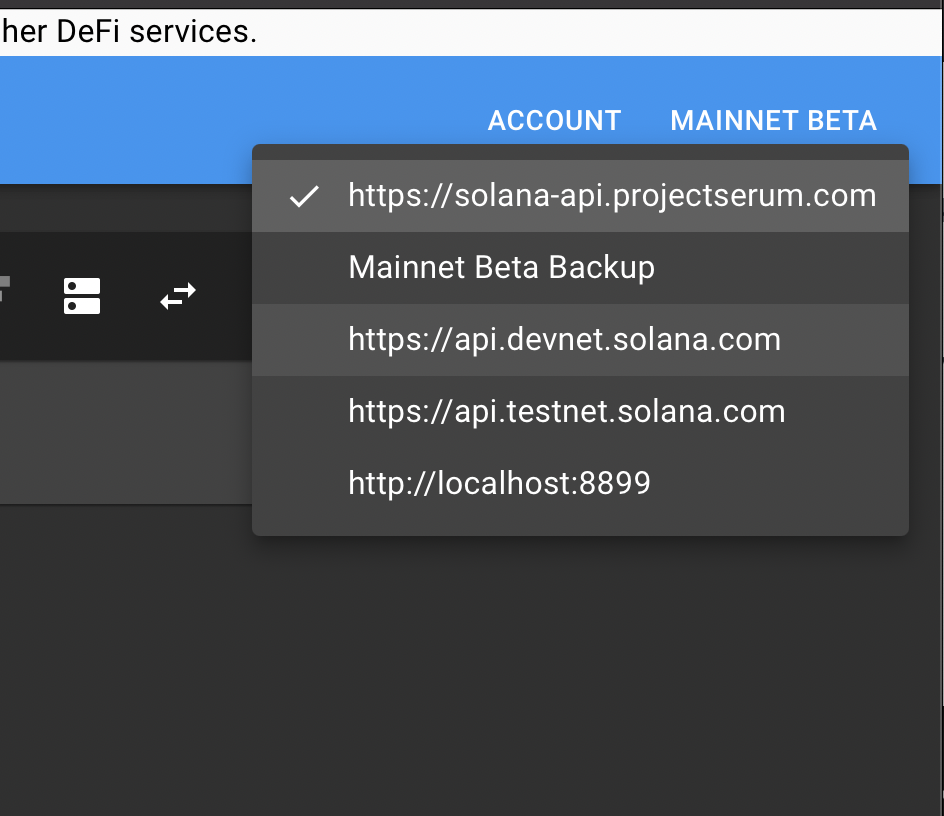
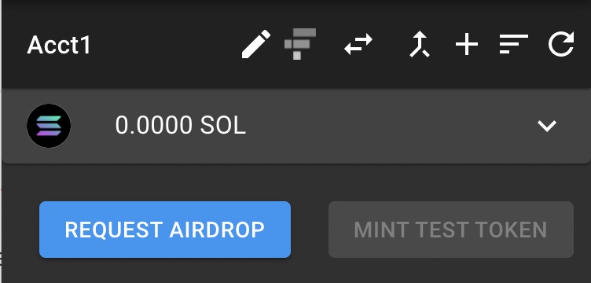
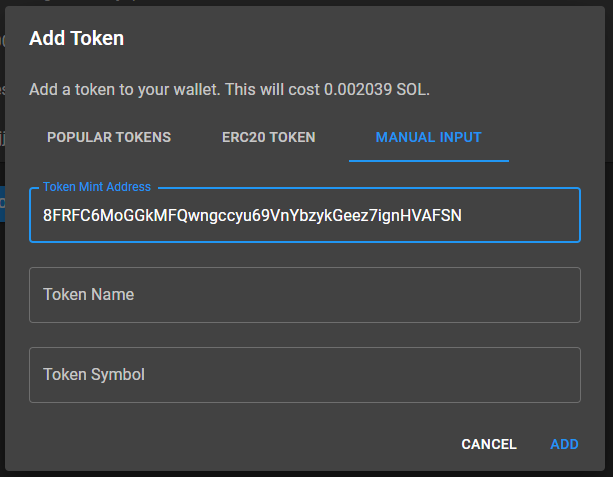
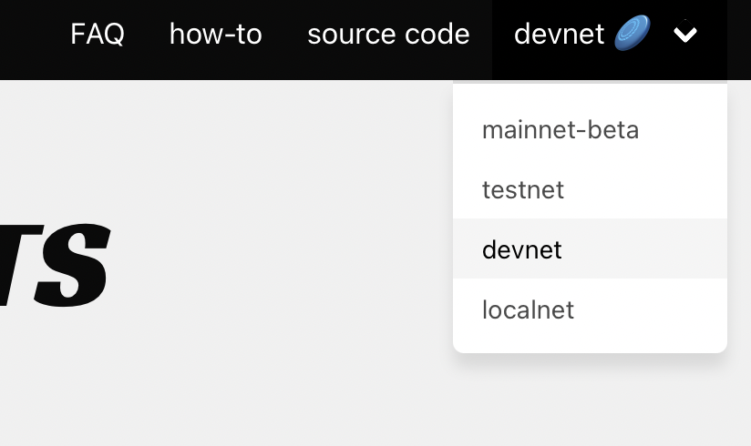
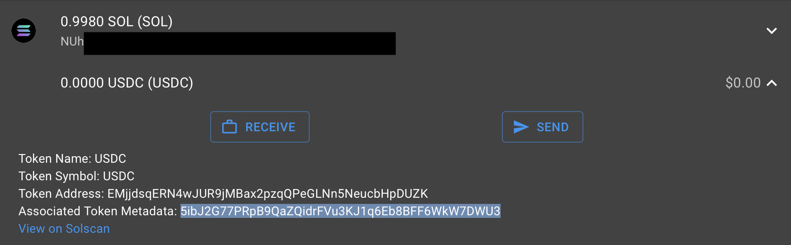
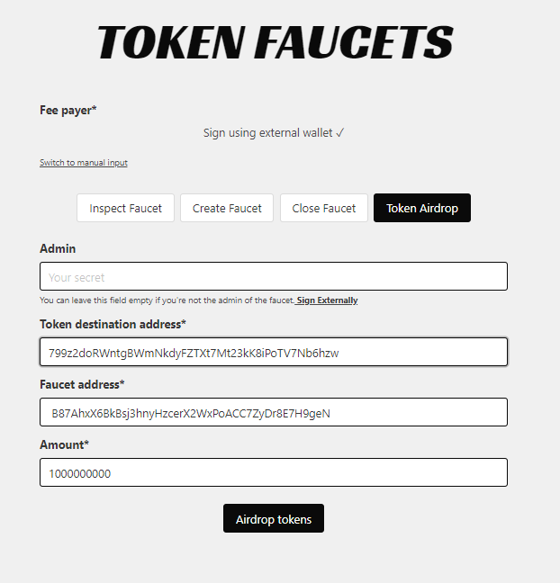

# How to Receive devnet Tokens

## How to receive USDC on devnet? 

It can be helpful to test on Devnet when integrating into the platform for trading, market making, or running liquidations without risking valuable tokens. 

First, connect your sollet.io wallet to the devnet network. Sollet.io \(NOT browser extension\) is the only functional devnet wallet at this time. 

Network can be toggled in the top right of the wallet. 

Request an airdrop to receive devnet $SOL 

Next, add a token with manual input of mint address: 8FRFC6MoGGkMFQwngccyu69VnYbzykGeez7ignHVAFSN

This is a devnet USDC mint created by Mango team. 

Now, visit  [https://spl-token-ui.netlify.app/\#/token-faucets](https://spl-token-ui.netlify.app/#/token-faucets)

 Change the network from mainnet-beta to devnet from the top right drop down. 

Select, 'Token Airdrop'

In  'Token Destination Address' paste the Associated Token Metadata address for the USDC mint, NOT the normal receive address. 

Enter Faucet address: **B87AhxX6BkBsj3hnyHzcerX2WxPoACC7ZyDr8E7H9geN** 

 Enter the amount of USDC you wish to receive in 'Amount'. There is 9 decimals on the mint, so an amount of 1000000000 will return 1.0 USDC in your wallet

Click 'Airdrop Tokens', approve the transaction in your wallet and your wallet will be funded with devnet USDC. If you're having trouble approving the transaction, make sure your sollet wallet is not open an any other browsers and pop ups are enabled. 

