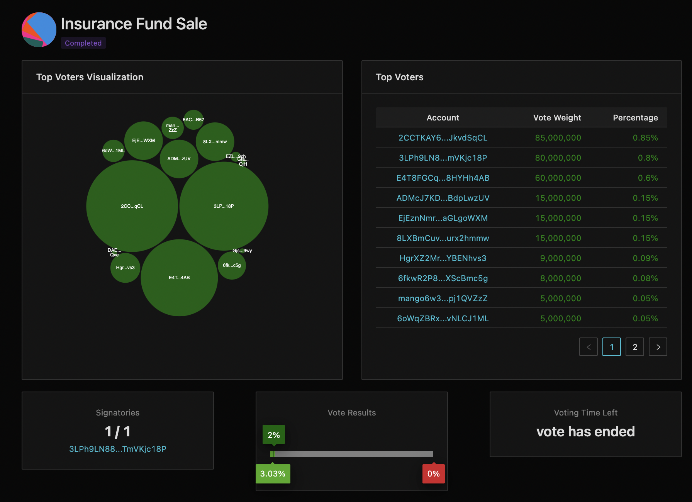

# How to Vote in Governance

MNGO is a governance token whose ownership grants voting rights on proposals to dictate Mango protocol's future. 

Mango's code maintenance and future releases are reliant on successful proposals to update the smart contracts owned and controlled by the DAO. Additionally, 90% of MNGO tokens will be locked in a smart contract, only accessible via DAO governance votes. 

Always do your research when voting. There is a #governance channel in Mango's Discord to discuss proposals and ask any questions you may have. 

###  How to vote: 

Go to the Realm page: [https://dao.mango.markets/#/realm/DPiH3H3c7t47BMxqTxLsuPQpEC6Kne8GA9VXbxpnZxFE?programId=GqTPL6qRf5aUuqscLh8Rg2HTxPUXfhhAXDptTLhp1t2J](https://dao.mango.markets/#/realm/DPiH3H3c7t47BMxqTxLsuPQpEC6Kne8GA9VXbxpnZxFE?programId=GqTPL6qRf5aUuqscLh8Rg2HTxPUXfhhAXDptTLhp1t2J) 

 Connect your wallet. 

Click the 'Deposit Governance Tokens' button.

A dialog will appear saying 'Deposit your tokens?' Click Deposit.

This will bring up a wallet approval step, for the entirety of your MNGO tokens in your account. This is a scary step.

The UI shows a message: 'Tokens have been deposited'. A new button 'Withdraw Governance Tokens' appears. 

The **Guiwem4qBivtkSFrxZAEfuthBz6YuWyCwS4G3fjBYu5Z** governance item shows the number of deposited tokens.

Under Governances, select **Guiwem4qBivtkSFrxZAEfuthBz6YuWyCwS4G3fjBYu5Z **or visit [https://dao.mango.markets/#/governance/9RGoboEjmaAjSCXsKi6p6zJucnwF3Eg5NUN9jPS6ziL3?programId=GqTPL6qRf5aUuqscLh8Rg2HTxPUXfhhAXDptTLhp1t2J](https://dao.mango.markets/#/governance/9RGoboEjmaAjSCXsKi6p6zJucnwF3Eg5NUN9jPS6ziL3?programId=GqTPL6qRf5aUuqscLh8Rg2HTxPUXfhhAXDptTLhp1t2J)

In the Proposals page,  parameters will be shown at the top of the screen. 

_Max voting time: 3 days; Yes vote threshold: 2%; Min instruction hold up time: 0 days; Min tokens to create proposal: 1,000,000 (0.01%)_

Select the proposal you wish to vote on or view. A voting page appears containing relative stats. 

If the proposal is in voting session,  there are 'Yeah' and 'Nay' buttons in the top-right. 

To vote, click '**Yeah**' or '**Nay**'. The page asks to confirm your vote. Click 'Confirm' (or 'Cancel' if you don't want to proceed).The UI shows a notification saying 'Proposal voted on'. 

You're done. Your tokens are in the governance system for now. You can withdraw them, but if you withdraw them before the vote is complete it will also withdraw your vote. After the vote completes you can withdraw your tokens without affecting your vote. 
