# Trading 📈

## **Welcome to **🥭 Market**s**

Use the Mango interface to interact with the protocol to margin trade on the Serum DEX markets as well as trade leveraged perpetual futures, all within one unified interface. 

Trade spot margined markets with up to 5x leverage and perpetual futures markets with up to 10x leverage. Long and short everything, with limit or market orders, more advanced order types coming soon. 

**Check out the **[**trade page. **](https://trade.mango.markets)****

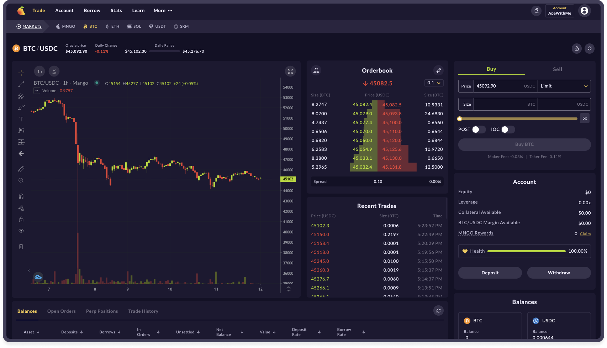

_Mango users save substantially on Serum DEX trading fees_; [Serum](https://projectserum.com) powers mangos spot margined markets. SRM deposits are pooled together to give every Mango user the ability to save substantially on taker fees. There is more info below under [Fee Discounts](getting-started.md#how-to-view-fee-discounts-contribute-srm). 

## **Navigating the Markets**

To get to the markets, click "Trade" in the main navigation, You should see all the _Markets Menu_ right above the exchange tooling (trading view, order-books, etc).

.png>)

Mango also gives you the ability to customize your experience, decide what markets you want to see or not see.  

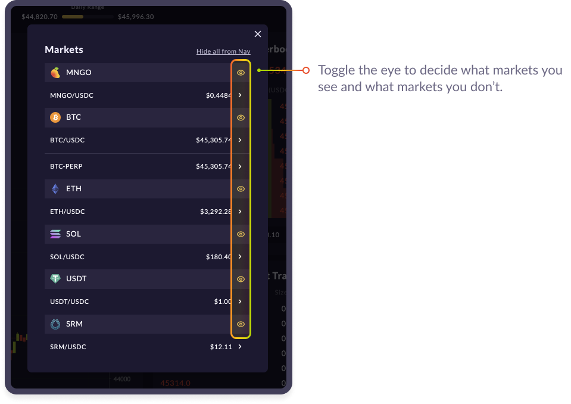

## More Customization 

Mango offers you the ability to customize you trading experience. Create multiple accounts, choose theme styling, adjust window size & placement, switch order-book type, and utilize the trading view to its full extent.

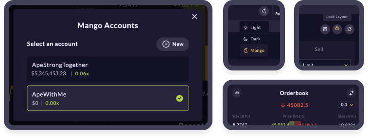

## Placing a Trade on 🥭 

To place an order, first decide whether you want to Buy or Sell an asset. 

Note when doing limit orders, the options of POST and IOC. 

* When IOC (Immediate or Cancel) is selected - if an order is placed and not filled within seconds, it's canceled. 
* When POST is selected, limit orders are added to the order book and earn maker fees if filled. 
* POST orders will always be the 'maker'.

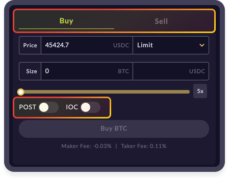

Limit orders open an order at a set price. If the price action of an asset in the order-book reaches that price, the order will get filled.  

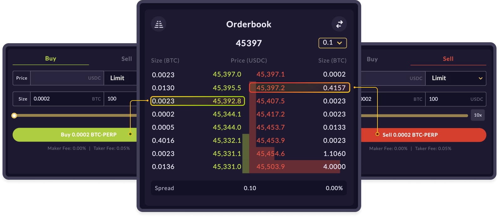

Market orders hit the book immediately on the bid or ask side depending on if you bought or sold, the position then fills at an average price of the orders taken.

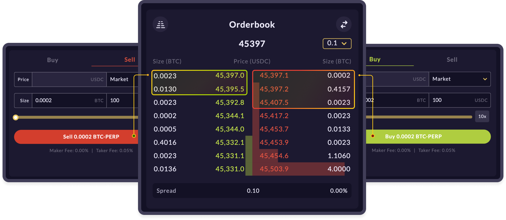

Spot margined positions can be viewed under your accounts tab within your portfolio view under "Balances", Perpetual positions can be viewed. 

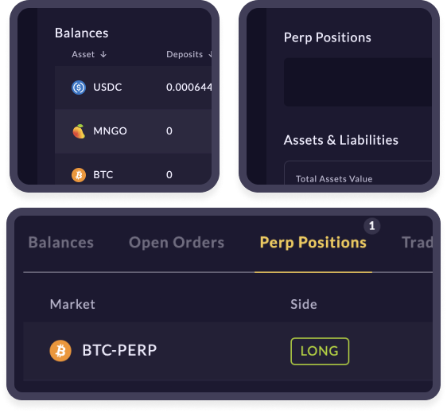

**For Spot margined markets** to make a leveraged trade, place an order with a size greater than your deposit value; funds are automatically borrowed or utilize the leverage slider to decide your risk or don't worry about margin or leverage at all and treat it as a spot market; Simply exchange for the even value of another asset.

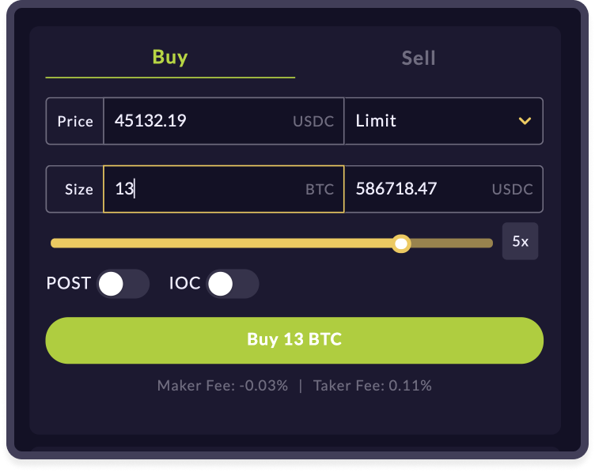

**For perpetual futures markets** to make a leveraged trade is very similar, except your are not buying the asset in question, you are simply buying exposure to that asset and its price movements, positions can be view under the perp positions tab under or under accounts tab. 

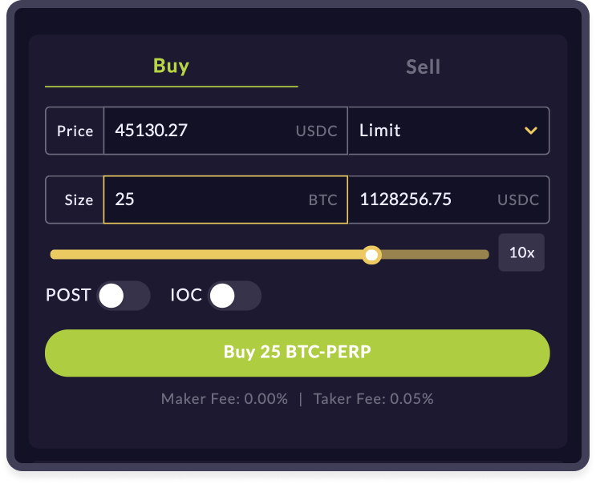

## Spot Margined Markets 

Mango and its spot margined markets are built on top of the Serum DEX ecosystem. Mango's risk engine allows users to trade Serem DEX's order-books with up to 5x leverage. 

## Perpetual Futures Markets 

Mango also offers perpetual futures built on the Mango protocol with its own order-book. Trade with up to 10x leverage and enjoy permissionless price exposure to any of the assets int he mango group. (currently there is only BTC-PERP, but will be adding more markets soon) 

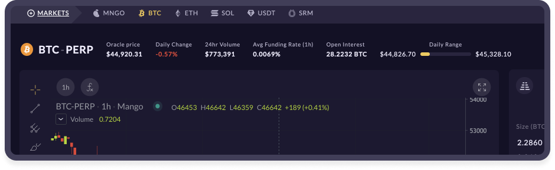

## 🥭 **pays the Lowest Fees **

Mango traders save substantially on Serum DEX trading fees by pooling SRM together in Mango. Serum's tier structure determines fee rates based on the amount of SRM held in an account; the more SRM in an account, the less you pay in fees and the more you earn as a maker. The highest tier is 1 MegaSerum(MSRM), worth 1 million SRM, and unrealistic for most people to obtain. 

Luckily, Mango margin accounts are structured such that SRM deposits are combined with all users to collectively reach a higher tier and benefit together when trading on the platform. \
\
SRM deposits are counted as collateral and toward the community fee tier. 

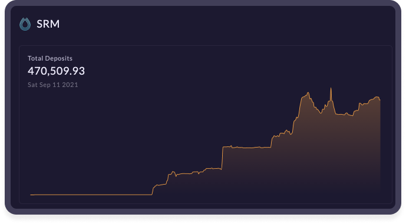

## **Join the community **👾

The Mango team is committed to providing a fully decentralized, open source, leveraged trading platform capable of matching a centralized-exchange feel with all the unique benefits of DeFi. We are excited to launch Mango Markets and continue bringing new leveraged trading products to life in decentralized form. Visit us at [mango.markets](https://mango.markets) to trade and lend.

Follow Mango Markets on Twitter and join the Discord for the latest updates.

twitter:[ https://twitter.com/mangomarkets](https://twitter.com/mangomarkets)

discord: [https://discord.gg/YpzUSTwd](https://discord.gg/P7TzZS9g)
